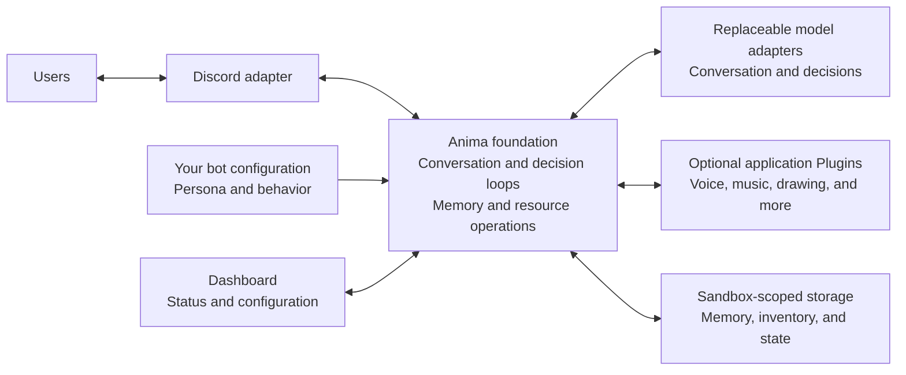

# Anima

[](https://github.com/nrmojp/anima/actions/workflows/test.yml)

Anima is a transport-neutral Python foundation for persona agents. It separates a
SDK-independent core from optional capabilities and from adapters such as Discord or model
providers.

This repository is pre-alpha. The public contracts may change before `1.0`.

## How it fits together

Discord is the user-facing interface; Anima runs the agent. Your application supplies
the persona and optional Plugins, without copying or modifying the framework.



The core contracts are transport- and provider-neutral. Discord is the supplied
chat adapter, not a dependency of the core. See [Architecture](docs/architecture.md)
for internal boundaries and [Plugin development](docs/plugin-development.md) for
extension contracts.

## What you can build

| Bot | Starting point | Optional extensions |
| --- | --- | --- |
| A character chat companion | Persona, conversation, and sandbox-scoped memory | Your own behavior and resource Plugins |
| A voice companion | The text bot plus the bundled local Voice reference Plugin | Music and sound-effect Plugins through the shared mixer |
| A creative assistant | Conversation, inventory, and temporary artifacts | Your own drawing or other creation Plugins |
| A specialized community bot | The same foundation with your configuration | Domain-specific tools, commands, and dashboard panels |

Music and drawing are extension examples, not bundled features. Start with a
text-only bot, then add only the Plugins your application needs.

## Get started

Start with [Get started](docs/get-started.md) to install a pinned Anima dependency,
create a minimal text-only bot, and verify its first reply. No framework checkout
or Plugin is required for that first launch.

Anima is a **base to build on**, not a finished character bot or a collection of
ready-made features. Keep your application, persona in `config/`, and Plugins
separate from the Anima dependency. A text-only bot needs
configuration changes, not changes to the framework.

Continue with [Build your own bot](docs/build-your-bot.md) for customization and
[library usage](docs/library.md) for packaging. The bundled Echo and local Voice
Plugins are reference implementations;
you do not need to keep them enabled.

## Run from a framework checkout

This alternative is for framework development or trying the repository's local
Docker recipe. Requirements: Git, Docker with Compose v2 (or Python 3.14 or later
for a local process), a Discord bot with Message Content Intent enabled, and an
OpenAI API key.

```sh
cp .env.example .env
# Fill both secrets and ANIMA_ALLOWED_GUILD_IDS in .env (empty means no guilds).
# Prepare bind-mount permissions for the container's uid 10001:
mkdir -p state
# On Linux: give uid 10001 write permission to state/ and config/.
docker compose up --build
```

The project does not publish a prebuilt Docker image. `docker compose` builds it locally
from this repository, so users obtain third-party Python packages and the Python base
image from their original distributors during the build.

The operations dashboard is available at
[http://127.0.0.1:8765/](http://127.0.0.1:8765/) by default. Its status endpoint is
`/api/status?sandbox=guild:<id>` and its health probe is `/health`.
The host port is bound to loopback, not exposed to the LAN. The container listens on
its bridge interface only to support that mapping. By default the UI is read-only;
set `ANIMA_DASHBOARD_ADMIN_TOKEN` to a long private token to enable edits and reload.

For a local process:

```sh
python3.14 -m venv .venv
.venv/bin/python -m pip install -e '.[bot]'
.venv/bin/anima run
```

Edit `config/persona.md` and `config/rules.md` to create a persona. Keep private persona
content in your own fork; the upstream sample remains deliberately neutral. Set
`ANIMA_ALLOWED_GUILD_IDS` to comma-separated guild IDs. Empty means deny all guilds;
DMs are separately opt-in with `ANIMA_DM_ENABLED`. `ANIMA_PERSONA_NAMES` optionally
adds comma-separated calling names; otherwise mentions, bot replies, and DMs trigger
conversation. There is no hardcoded persona name.
The bundled [local Voice Plugin](docs/voice.md) uses eSpeak NG to play speech
in the requesting member's current Discord voice channel. It needs no speech API or
downloaded model. Configure it in
[`config/plugins/voice.json`](config/plugins/voice.json).
Speech is routed through a shared three-lane [audio mixer](docs/audio.md). The `music`
and `effect` routes are ready for optional Plugins even though no such Plugins are
bundled in the template.

## Base system

Every sandbox has serialized conversation, mood, learned habits, digest, unfinished
intentions, long-term memory, inventory, and temporary artifacts. Nap, sleep,
reflection, automatic sleep checks, and bounded self time are included. Long-term
memory uses sandbox-specific OpenAI Vector Stores with local retrieval fallback.
Tools are primitive resource operations; plugins extend their targets declaratively.
The dashboard shows state, memory contents, inventory, resources, asynchronous jobs,
self-time sessions, reasoning summaries, usage, and errors.

Use `/anima-mode` to switch between silent, reply, react, and proactive, and
`/anima-maintenance` for controlled maintenance. The base's react mode does not create
emoji reactions unless a fork provides that capability. Proactive speech works without
an emoji plugin. Music, drawing, reminders, custom reactions, persona, and media assets
are intentionally not bundled.

Operational commands include:

```sh
anima sandboxes
anima status --sandbox guild:123 --json
anima doctor --sandbox guild:123
anima memory-audit baseline --sandbox guild:123
anima memory-index status --sandbox guild:123
# Stop the bot before sync, rebuild, prune --apply, backup, or restore.
anima memory-index sync --sandbox guild:123
```

Index mutations call OpenAI; review data and cost before running them. See
[backup/recovery](docs/backup.md) and [migration notes](docs/compatibility.md).

## Architecture

```text
Composition Root
  ├─ Core (persona agent, events, sandbox identity, ports)
  ├─ Capability Registry and PluginLoader
  │    ├─ Tool providers
  │    ├─ Command providers
  │    ├─ Structured response and availability providers
  │    └─ Plugin lifecycle, storage, and typed configuration
  └─ Adapters (Discord, OpenAI, memory, storage, audio, dashboard)
```

Dependency direction is strict:

- `core` imports neither plugins nor adapters.
- `core` and `capabilities` form the neutral domain contracts; neither imports SDKs,
  adapters, bootstrap, or concrete plugins.
- each plugin keeps its implementation, Ports, Adapters, and dependencies inside its
  own directory.
- adapters translate external SDK types at the boundary.
- the host assembles shared infrastructure; each Plugin assembles its own concrete
  implementation using sandbox-bound services.

Plugins are trusted in-process code. This API is an extensibility boundary, not a
security sandbox and not an automatic loader for arbitrary Python files.

## Try the reference plugin

```python
from anima.capabilities.plugin_loader import PluginLoader

catalog = PluginLoader().load()
print([manifest.name for manifest in catalog.manifests])
```

See [Plugin development](docs/plugin-development.md) for a complete flow.
The [architecture](docs/architecture.md) defines dependency and trust boundaries, and
the [base routes](docs/base-routes.md) list the shared extension paths, while
the [public scope](docs/public-scope.md) lists excluded private content and asset-license
boundaries.
See the [compatibility policy](docs/compatibility.md) and
[release checklist](docs/releasing.md) before publishing a fork.

## Development

```sh
python -m venv .venv
.venv/bin/python -m pip install -e '.[dev]'
.venv/bin/python -m unittest discover -s tests -v
.venv/bin/python -m coverage run --source=src/anima -m unittest discover -s tests
.venv/bin/python -m coverage report --show-missing
```

## License

Anima's original source code and documentation are licensed under MIT. This license does
not replace the licenses of Python, discord.py, the OpenAI Python SDK, their transitive
dependencies, or content added by users. Use of Discord and OpenAI is also governed by
their respective service terms.

The project currently distributes source code only and does not publish a prebuilt
Docker image. If binary images or bundled third-party assets are distributed in the
future, their license and notice obligations must be reviewed before publication.
